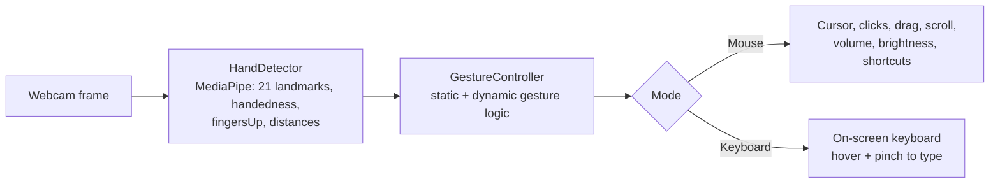

# ✋ A Real-Time Human-Computer Interaction Using Hand Gestures in OpenCV

Control a computer with your bare hands. A standard webcam becomes a **virtual mouse and
keyboard**: move the cursor, click, drag, scroll, type, adjust volume and brightness, take
screenshots and launch apps — all through hand gestures, with no wearables and no depth camera.

📄 **Published at ICTIS 2023 (Springer).** See [Publication](#publication).


## Overview

Conventional interaction assumes a mouse and a keyboard, which assumes a user who can comfortably
operate one. This project replaces both with gestures, aimed at making a desktop usable for people
who cannot — and it needs nothing but an ordinary webcam.

MediaPipe extracts 21 hand landmarks per frame, the finger-state pattern is read as a gesture, and
the gesture is dispatched to the OS as a real mouse, keyboard or application action. Both **static
gestures** (a finger pose) and **dynamic gestures** (motion over time, used for scrolling and
volume/brightness) are supported.

## Features

The system runs in two modes, toggled by a mode-switch gesture. **Neutral** — all five fingers
open — is the home position most shortcuts must be entered from.

### Mouse mode

| Gesture | Fingers | Action |
| --- | --- | --- |
| Open palm | all 5 | Neutral (home state) |
| Index only | `[0,1,0,0,0]` | Move the cursor |
| Index + middle (V) | | Arm the click state |
| V → index only | | Left click (right hand) / right click (left hand) |
| V → middle only | | Right click (right hand) / left click (left hand) |
| V, fingers pinched | ratio < 1.1 | Double click |
| V → fist | `[0,0,0,0,0]` | Press and hold — drag; reopening to V releases |
| Neutral → fist | | Screenshot, saved to `Pictures/Screenshots/` |

### Three fingers — continuous controls

With `[0,1,1,1,0]` the hand becomes an analogue control, and the axis of motion selects what it
drives:

| Hand | Motion | Controls |
| --- | --- | --- |
| Right | horizontal | Scroll left / right |
| Right | vertical | Scroll up / down |
| Left | horizontal | Volume up / down |
| Left | vertical | Brightness up / down |

Holding the gesture accelerates it — the step size doubles the longer you hold a direction (capped
at 4x for volume) — so a nudge and a long sweep are both comfortable.

### Application shortcuts

| Gesture | Right hand | Left hand |
| --- | --- | --- |
| Index + pinky | Open browser | — |
| Thumb only | New tab (Ctrl+T) | Close tab (Ctrl+W) |
| Thumb + pinky | Open messaging app | Open calculator |

### Keyboard mode

A virtual QWERTY keyboard is drawn over the camera feed — digits, letters, plus `<--`, `CAPS`,
`SPACE` and `ENTER`. Hover the index finger over a key and pinch to press it. Capture resolution
is raised to 1280x720 in this mode so the key targets are large enough to hit reliably.

## How It Works



**1. Hand detection** (`hand_tracking_module.py`). A `HandDetector` class wraps MediaPipe Hands and
returns, per hand: the 21 landmark points, a bounding box, a centre, handedness, and — through
`fingersUp()` — a five-element binary vector of which fingers are extended.

**2. Gesture control** (`main.py`). The `GestureController` reads that vector every frame and runs
a state machine over it. The key design decision is that **gestures are transitions, not poses**:
a click is not "index finger up", it is "index finger up *arriving from* the V pose". Requiring a
previous state means a hand passing incidentally through the frame does not fire an action, and a
`buttonDelay` counter debounces the ones that do. Without it, every intermediate pose the hand
passes through on the way to a gesture fires its own action.

**3. Cursor mapping.** Pointer motion is mapped from a reduced interaction rectangle inside the
frame, so the whole screen is reachable from a small hand movement rather than a reach across the
camera's field of view. Positions are exponentially smoothed (`smoothening = 7`) to take the
jitter out of the cursor.

## Tech Stack

- **Language**: Python
- **Computer Vision**: OpenCV, MediaPipe, cvzone
- **Numerical**: NumPy
- **System control**: PyAutoGUI, autopy, pynput, screen-brightness-control, AppOpener

> **Platform note** — this targets **Windows**. It uses the DirectShow capture backend
> (`cv2.CAP_DSHOW`), the `USERPROFILE` environment variable for the screenshot path, and
> `AppOpener` for launching applications. The tracking and gesture logic are portable; the
> OS-action layer would need replacing for macOS or Linux.

## Repository Structure

```
A-Real-Time-Human-Computer-Interaction-using-Hand-Gestures-in-OpenCV/
├── src/
│   ├── hand_tracking_module.py   # HandDetector: MediaPipe wrapper
│   └── main.py                   # GestureController, virtual keyboard, real-time loop
├── docs/
│   ├── Project Report.pdf        # full 63-page project report
│   └── Project PPT.pptx          # project presentation
├── assets/                       # figures used in this README
├── requirements.txt
├── README.md
└── LICENSE
```

## Running the Project

Requires Python 3.8+ and a webcam (Windows recommended for full functionality).

```bash
pip install -r requirements.txt
python src/main.py
```

Press `q` to quit.

## Dataset

None. MediaPipe's hand-landmark model is pretrained, and every gesture is defined by explicit
geometric rules over the landmarks rather than learned from collected data.

## Known Limitations

Frame rate is the binding constraint. On an underpowered machine, in poor lighting, or against a
cluttered background, per-frame inference slows down and a low FPS shows up directly as lag
between the gesture and the action. Good lighting and a plain background make a large difference.

## Publication

Presented at **ICTIS 2023**, the 7th International Conference on Information and Communication
Technology for Intelligent Systems (Ahmedabad, India), and published by Springer.

> Kedarisetty Vishnu Sainadh, Kukkadapu Satwik, Vadde Ashrith, D. K. Niranjan. "A Real-Time Human
> Computer Interaction Using Hand Gestures in OpenCV." In: *IoT with Smart Systems: ICTIS 2023,
> Volume 2.* Lecture Notes in Networks and Systems, vol. 720. Springer Nature Singapore, 2023,
> pp. 271–282.

🔗 **[Read the paper (Springer, DOI: 10.1007/978-981-99-3761-5_26)](https://doi.org/10.1007/978-981-99-3761-5_26)**

## Future Scope

- Port the OS-action layer to macOS and Linux.
- Adapt to individual users and lighting conditions over time with a personalised model.
- Extend to virtual reality, robotics and assistive-technology use cases.

## Acknowledgments

B.Tech project in Computer Science and Engineering at **Amrita School of Computing, Bangalore**
(Amrita Vishwa Vidyapeetham), December 2022, guided by Mr. Niranjan D K, by Vishnu Sainadh
Kedarisetty, Satwik Kukkadapu and Ashrith Vadde.

## Documentation

- 📄 [Project Report](docs/Project%20Report.pdf)
- 📊 [Presentation](docs/Project%20PPT.pptx)
